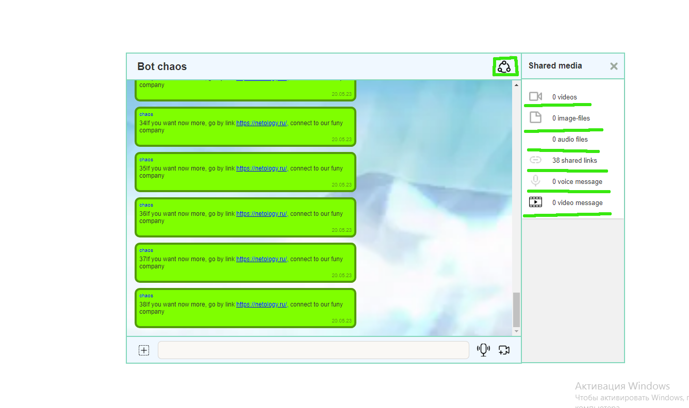
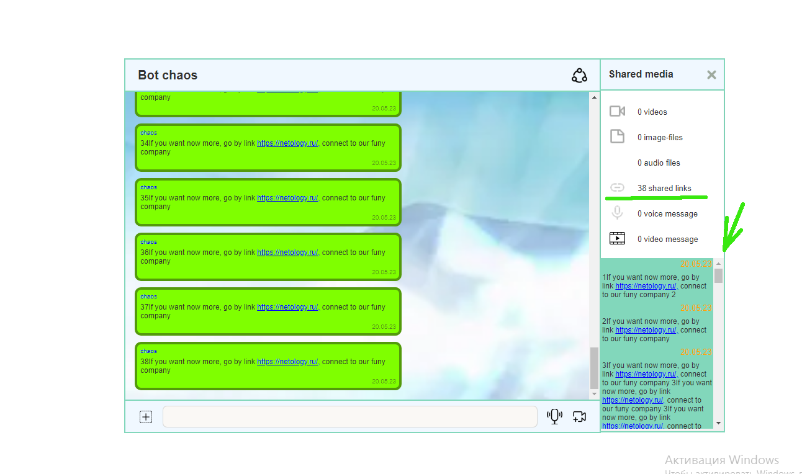
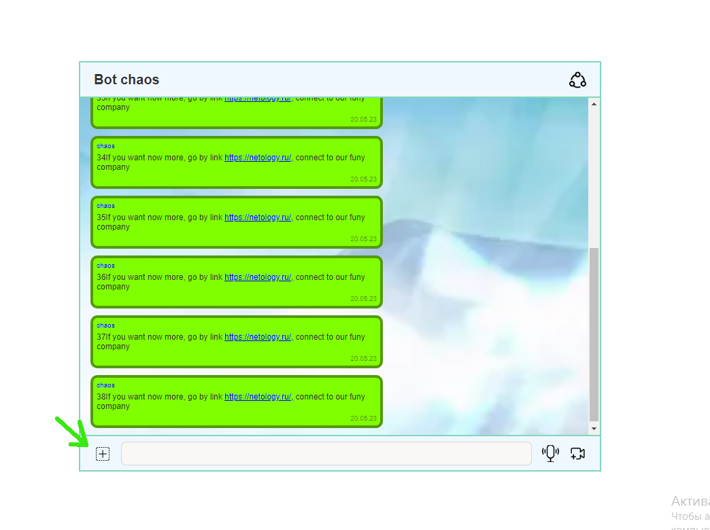
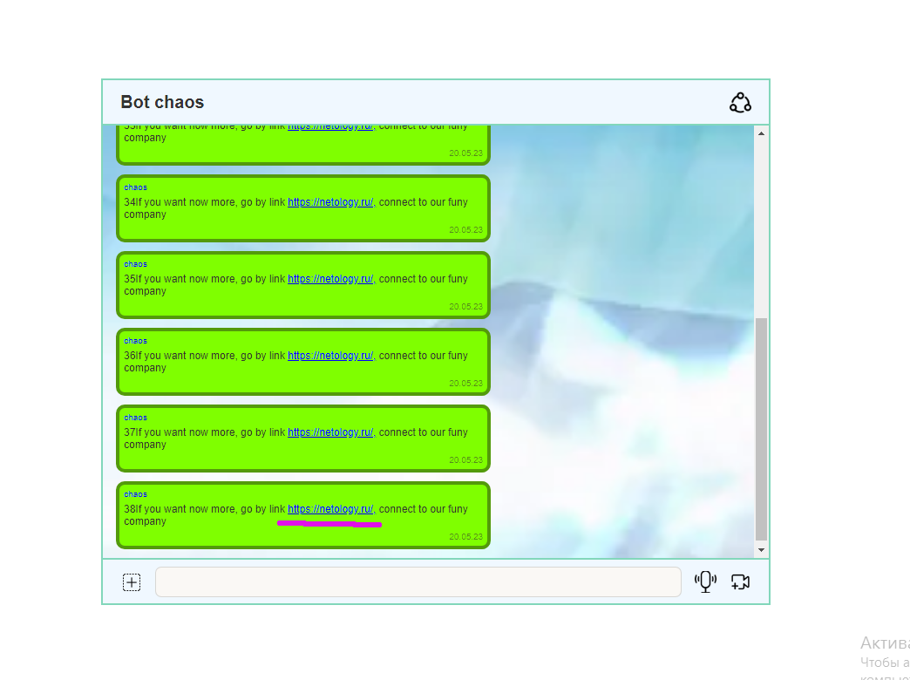
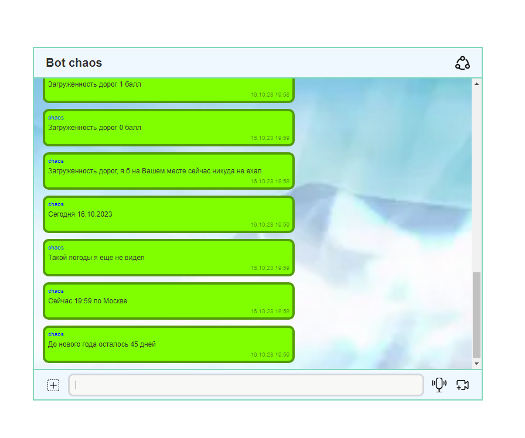
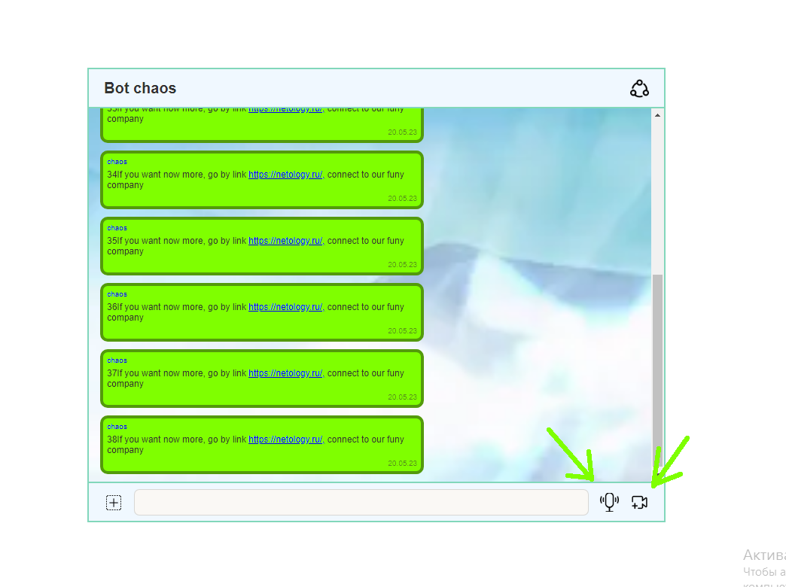
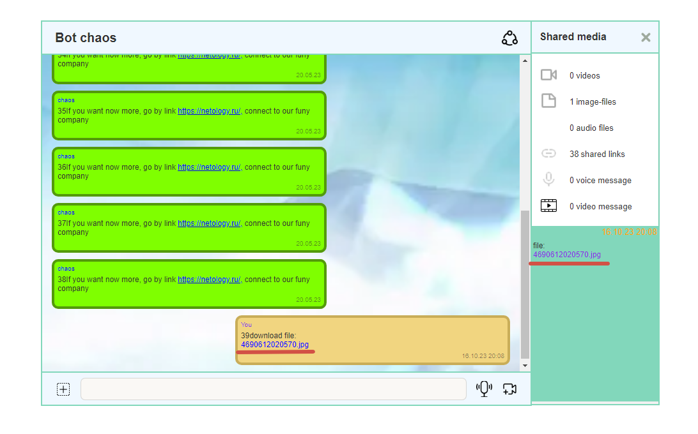

## Функциональность приложения

1. Ведется статистика отправленных файлов по типам и ссылкам. Поле share, нажав на иконку откроется блок со статистикой
   
2. Получение вложений по категориям загруженных файлов и ссылок, нужно кликнуть по одному из пунктов share
   
3. Загрузка файлов. Нажав на крестик в нижнем левом углу, можно загрузить файл, также это можно сделать перетаскиванием.
   
4. Можно отправить сообщение в чат, если отправлена ссылка она будет выглядеть как ссылка
   
5. Можно установить напоминание командой @schedule: 18:04 31.08.2019 «Последний день лета»; достаточно ввсти команду с указанием даты времени и текста в указанном формате.
   
6. Можно запросит информацию у бота
        - @chaos: weather - погода рандом
        - @chaos: time - время актуальное (по крайней мере которое стоит на компьютере)
        - @chaos: date - сегодняшняя дата (по крайней мере которая стоит на компьютере)
        - @chaos: traffic - пробки рандом
        - @chaos: new-year - сколько дней до нового года

    
7. Можно записать видео или аудио сообщение удерживая соответствующую иконку
   
8. При загрузке приложение запросит геолокацию и она будет сохранена, можно отказаться.
   
9.  Файлы можно скачать или из поля для сообщений, или из блока share. нужно просто кликнуть по соответствующей ссылке.
    
10. При прокрутке поля для сообщений вверх, будут появляться более поздние сообщения.

Более подробно в описании ниже:

## Реализованные функции

1. ### сохранение в истории ссылок и текстовых сообщений
   
   При отправке сообщения текстового или со ссылкой это сообщение на сервере попадает в базу - массив сообщений состоящий из объектов, один объект - одно сообщение.

   Если сообщение содержит ссылку то в файл stat добавляется статистика, что добавлено определенное количество ссылок.

2. ### ссылки (http:// или https://) должны быть кликабельны и отображаться, как ссылки;
   
   Введя сообщение в поле для отправки сообщения и нажав enter, сообщение сохраняется на сервере и прилетает ответом.

   Метод renderingMessage(data, mark) в классе redrawApp перебирает массив объектов сообщений и отправляет каждый объект в класс pattern, где в методе createMessage(data) оно проверяется на наличие ссылки при помощи регулярного выражения формируется необходимым образом и возвращается уже сформированным сообщением в renderingMessage где добавляется в поле для сообщений в приложении.
   
3. ### сохранение в истории изображений, видео и аудио (как файлов) — через Drag & Drop и через иконку загрузки;

    Для отправки файла необходимо нажать на крестик в левом нижнем углу приложения, или перетащить файл на этот же крестик

    Файл будет отправлен через метод getNewFile(formData, 'addFile/'); в классе redrawApp, а оттуда через метод create класса http, на сервер и там будет сохранен в подходящей папке (в зависимости от типа файла).

    сервер вернет объект с необходимыми данными для отрисовки сообщения, метод класса pattern проверит его и сформирует сообщение для вставки, вернет его и метод renderingMessage(data, mark) добавит его в поле для сообщений, с возможностью скачивания.

    статистика по количеству загруженных файлов и каких именно файлов (тип файла) в приложении и на сервере будет обновлена.
    Данные для статистики хранятся на сервере.
   
4. ### скачивание файлов на компьютер пользователя;
   
   В поле для сообщений, если в сообщении есть файл, то сообщения формируются с возможностью скачивания. Нажав на ссылку в сообщении (строка синего цвета) файл будет загружен на компьютер пользователя.

   метод downloadFile в redrawApp сделает запрос на сервер через класс http метод read передав путь по которому хранится необходимый файл на сервере.
   Сервер в свою очередь вернет blob. 

   Формируется ссылка куда добавляется url и имитируется клик по этой ссылке, в результате чего происходит скачивание.
   
5. ### ленивая подгрузка: сначала подгружаются последние 10 сообщений, при прокрутке вверх подгружаются следующие 10 и т. д.

    При загрузке приложения, загружаются только 10 последних сообщений, при прокрутке вверх, 
    сообщения догружаются по 10 штук.

    При скролле вверх, как только e.target.scrollTop === 0 вызываем метод reloadingMessages()
    в redrawApp, в этом методе делаем запрос this.http.read(numid, 'reloadingMessages/') через класс http, сервер отбирает следующие 10 сообщений и через метод renderingMessage(data, mark) отрисовываем их в поле для сообщений.
    
6. ### запись видео и аудио, используя API браузера;

    При нажатии и удерживании одного из значков, таких как микрофон или камера которые находятся в нижнем правом углу приложения, можно записать аудио или видео сообщение, в соответствии нажатого и удерживаемого значка. При отпускании значка (когда клавиша мыши возвращается вверх) запись остановится.

    Сообщение будет отправлено на сервер и сохранено в соответствующей папке, а в качестве ответа мы получим объект с данными для отрисовки сообщения и добавим сообщение в приложение в поле для сообщений, с возможностью скачивания.

    Из controlApp будет вызван метод recordAudio или recordAudio класса redrawApp, и при остановке записи когда кнопка мыши будет отпущена будет вызван метод this.getNewFile класса redrawApp, а в нем будет вызван метод create класса http, и файл будет отправлен на сервер, сохранен в соответствующую папку и в качестве ответа мы получим объект с данными для отрисовки сообщения и обновления статистики. И добавим сообщение в приложение с помощью renderingMessage класса redrawApp.

    статистика в приложении и на сервере будет обновлена. также по типу файла, аудио сообщение или видео сообщение.
   
7. ### отправка геолокации;
   
    При запуске приложение запросит геолокацию с помощью метода start в redrawApp. Если разрешение будет получено в качестве колбека будет передан sendGeolocation метод из redrawApp.
    В этом методе мы получаем ширину и долготу и через метод sendToWs того же класса данные будут переданы через WebSocket на сервер и сохранены в папку db файл geolocation.js

    Если разрешение не будет получено в качестве колбека мы такжк передаем метод errorGeolocation, где будет обрабатываться ошибка.
   
8. ### установка напоминаний и напоминания через Notification API: @schedule: 18:04 31.08.2019 «Последний день лета»;

    Выполнив команду как указано выше указав время, дату и текст, установим напоминания. Написать нужно в поле для ввода текста

    В controlApp в методе сабмит при условии введения данной команды будет вызван метод .getMessageWs, в качестве параметров будут переданы тип schedule (по нему WebSocket распознает что делать с этим сообщением) и само сообщение.
   
9.  ### отправка команд боту: @chaos: погода, бот должен отвечать рандомным прогнозом погоды, интегрироваться с реальными сервисами не требуется, команд должно быть не менее 5;
    Команды:
        - @chaos: weather - погода рандом
        - @chaos: time - время актуальное (по крайней мере которое стоит на компьютере)
        - @chaos: date - сегодняшняя дата (по крайней мере которая стоит на компьютере)
        - @chaos: traffic - пробки рандом
        - @chaos: new-year - сколько дней до нового года

    В поле для ввода текста нужно ввести комнду
    так же как и с напоминаниями в controlApp мы получаем тест и в зависимости от содержимого отправляем на сервер данные через getMessageWs класса redrawApp, там будет сформирован объект и отправлен с помощью метода sendToWs того же класса на сервер. На сервере объект будет разобран и в зависимости от содержимого WebSocket вернет ответ.
  
10. ### просмотр вложений по категориям: аудио, видео, изображения, другие файлы (см. боковое меню Telegram);

    Для того чтобы воспользоваться данной функцией нужно открыть поле share, нажав на иконку в верхнем правом углу приложения

    Если был сделан click по одному из shared, то из data атрибута будет взят тип сообщений которые нужно загрузить (т.е. какого типа содержимое у сообщения должно быть) и вызван метод getShare класса redrawApp, в котором будет передан этот самый тип. По данному типу на сервере при помощи метода read класса http будет получен массив сообщений содержащих соответствующее содержимое. 

    Если массив будет пуст, нет таких данных то ничего не произойдет. А если массив будет содержать объекты с данными для сообщений, то данный массив будет передан в метод renderingShare класса redrawApp, оттуда массив будет передан в метод createShare класса pattern где будут сформированы элементы для вставки на страницу с прилдожением в соответствующее поле. Все элементы будут собраны в массив и возвращены в renderingShare.

    Далее в методе renderingShare элементы будут перебраны с помощью цикла и добавлены в приложение, предварительно перед вставкой элементов в методе getShare был вызван метод clearShareMessages класса redrawApp, для очистки поля для вывода полученных элементов, для того что-бы они там не накапливались.

    При закрытии поля share поле для вставки элементов очищается с помощью метода clearShareMessages и скрывается.